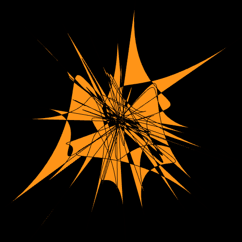
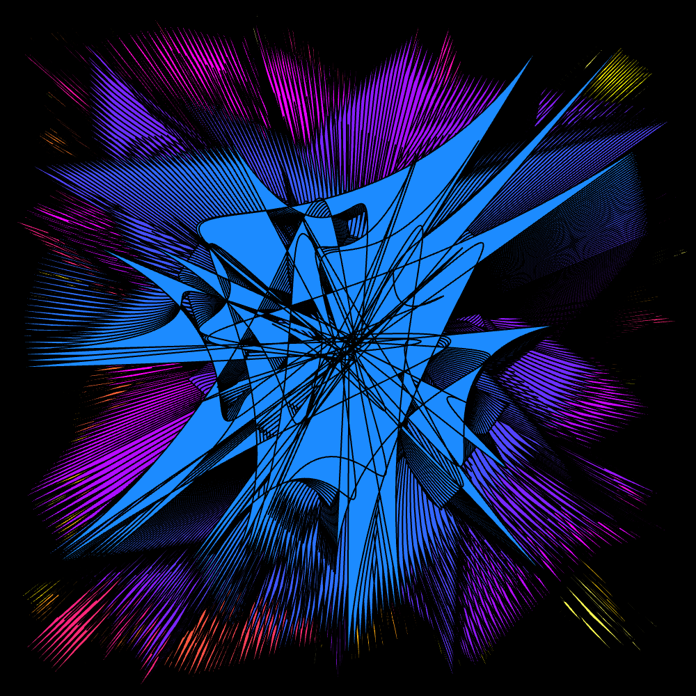
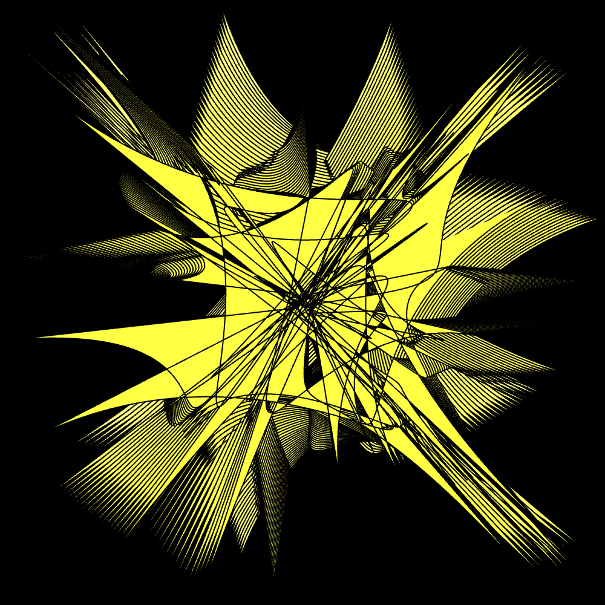

# maki9955_9103_tut1

## Quiz Submission

- ### Imaging Technique Inspiration

    > I chose [Unholy Bezier](https://editor.p5js.org/bayraktarege/sketches/k89S6u6H3) by [Ege Bayraktar](https://www.linkedin.com/in/ege-bayraktar-764b34111/).

    

    I really love the use of colors to create complex yet intersting shapes.
    Based on the requirements for our creative coding project, we need to apply some form of animation. His use of _sin_ and _cos_ to determine the color of the next series of shapes seems a bit complex however, it creates a visually engaging artwork. The color displayed is often similar to the previous one and this artwork is also downloadable by using the **saveGif** function.
    
    
    

- ### Coding Technique Exploration

    To achieve his meaningful use of colors to create complex shapes, I would need to make use of **_vertex()_** and **_bezierVertex()_** methods.

    The use of vertex is definitely instrumental to our final submission as all shapes are created from a series of vertices. Based on the project requirements and the complexity of each artwork, we will need to create our own shapes. Both functions are very important for us to do that.

    

    [Here](https://editor.p5js.org/codingtrain/sketches/O3_cLiOaw) is a link to a basic application of ***bezierVertex()***. Based on some further research, both functions must always be within the **beginShape()** and **endShape()** functions.
